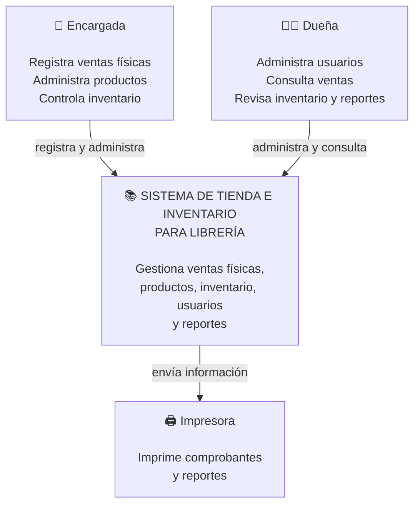

## Nivel 1 — Contexto del sistema TIENDA CON INVENTARIO (LIBRERIA) NOELIA HUANCA MAMANI

En este nivel mostramos el sistema de la librería desde una vista general. 

### Elementos del contexto

**Encargada:** es la persona que utiliza el sistema para realizar las actividades diarias de la librería. Registra las ventas físicas, administra los productos y controla el inventario.

**Dueña:** utiliza el sistema para administrar la librería. Puede consultar las ventas, revisar el inventario, consultar reportes y administrar los usuarios y permisos.

**Sistema de tienda e inventario:** es el sistema principal de la librería. Su función es gestionar las ventas físicas, los productos, el inventario, los usuarios y los reportes.

**Impresora:** es un elemento externo que se relaciona con el sistema. El sistema puede enviar la información necesaria para imprimir comprobantes de venta y reportes.

### Relaciones principales

* La **Encargada** utiliza el sistema para registrar y administrar las actividades de la librería.
* La **Dueña** utiliza el sistema para administrar y consultar información.
* El **Sistema** envía información a la **Impresora** para generar comprobantes y reportes.

