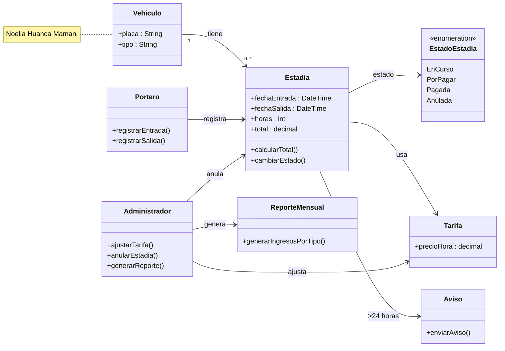

# DIAGRAMA DE CLASES – PARQUEO TORRE CENTRAL
## Diagrama

```mermaid
classDiagram
direction LR

class Vehiculo {
    +placa : String
    +tipo : String
}

class Estadia {
    +fechaEntrada : DateTime
    +fechaSalida : DateTime
    +horas : int
    +total : decimal
    +calcularTotal()
    +cambiarEstado()
}

class EstadoEstadia {
    <<enumeration>>
    EnCurso
    PorPagar
    Pagada
    Anulada
}

class Portero {
    +registrarEntrada()
    +registrarSalida()
}

class Administrador {
    +ajustarTarifa()
    +anularEstadia()
    +generarReporte()
}

class Tarifa {
    +precioHora : decimal
}

class Aviso {
    +enviarAviso()
}

class ReporteMensual {
    +generarIngresosPorTipo()
}

Vehiculo "1" --> "0..*" Estadia : tiene
Estadia --> EstadoEstadia : estado
Estadia --> Tarifa : usa
Portero --> Estadia : registra
Administrador --> Tarifa : ajusta
Administrador --> Estadia : anula
Administrador --> ReporteMensual : genera
Estadia --> Aviso : >24 horas

note for Vehiculo "Noelia Huanca Mamani"
```

