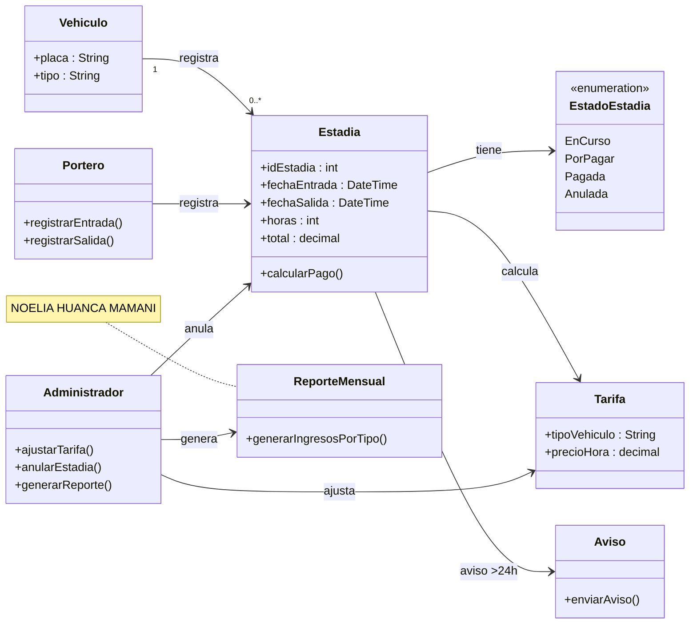

# DIAGRAMA DE CLASES – PARQUEO TORRE CENTRAL

**Nombre:** Noelia Huanca M.  
**Materia:** Arquitectura de Software  
**Evaluación Integradora – Variante B**

### Nota

Diagrama realizado a partir de los requerimientos del caso, identificando las clases, métodos y relaciones principales.

