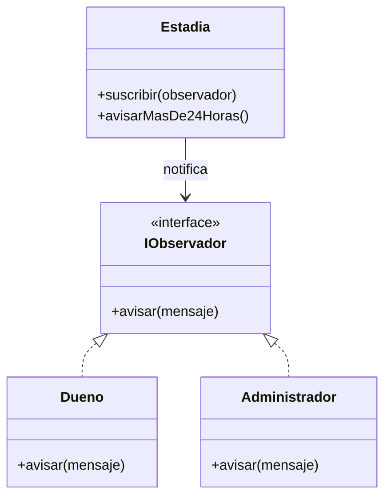

# Patrón Observer – Parqueo Torre Central

## Requerimiento

Cuando una estadía lleva más de 24 horas, el dueño debe recibir un aviso.

## Patrón aplicado

**Observer (Observador).**

Se utiliza porque una estadía puede avisar a los interesados cuando ocurre un cambio, en este caso cuando supera las 24 horas.

## Diseño

## ¿Por qué Observer?

Elegí Observer porque el requerimiento dice que cuando una estadía supera las 24 horas se debe enviar un aviso. La `Estadia` puede notificar a los interesados sin tener que conocer directamente cómo reciben el aviso.

Esto también permite agregar otros interesados después sin cambiar la lógica principal de la estadía.

## ¿Qué pasa sin el patrón?

Sin Observer, la clase `Estadia` tendría que llamar directamente a cada persona o sistema que debe recibir el aviso. Si después se agrega otro destinatario, habría que modificar la clase y el código se volvería más dependiente.
